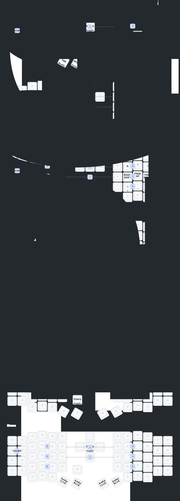

# Allie Cat Sofle ZMK Firmware

[](https://github.com/alliecatowo/zmk-sofle/actions/workflows/build.yml)
[](https://app.gitbook.com/o/3H4WaN1tEms6khZUHFAb/s/rPqJa63N36I6Y3X2pLjt/)
[](https://github.com/alliecatowo/zmk-sofle/wiki)

This repository contains the ZMK firmware and configuration for the **Allie Cat Sofle**, a custom-built split keyboard.

## Documentation

For full details on flashing, configuration, and hardware, please see our official documentation:

*   **[Read the GitBook](https://app.gitbook.com/o/3H4WaN1tEms6khZUHFAb/s/rPqJa63N36I6Y3X2pLjt/)**
*   **[Explore the GitHub Wiki](https://github.com/alliecatowo/zmk-sofle/wiki)**

The documentation is managed in the `/docs` directory of this repository.

## Quick Flash

Pre-built firmware can be downloaded from the **Artifacts** section of the latest [GitHub Actions build run](https://github.com/alliecatowo/zmk-sofle/actions/workflows/build.yml).

*   **Standard Mode**: `alliecat_keeb_studio_left.uf2` + `alliecat_keeb_standard_right.uf2`
*   **Dongle Mode**: See the [Dongle Mode Setup Guide](docs/dongle-mode.md).

### Flashing Steps

1.  **Enter Bootloader**: Double-tap the reset button on your keyboard half. It should appear as a `NICENANO` or `XIAO` drive.
2.  **Copy Firmware**: Drag and drop the `.uf2` file onto the drive.
3.  **Repeat**: Do the same for the other half.

## 🚀 Quick Start

### Option 1: Use Pre-built Firmware (Easiest)

1. Go to [Actions](https://github.com/alliecatowo/zmk-sofle/actions)
2. Click the latest successful build
3. Download the firmware artifacts
4. Flash according to your setup:
   - **Standard Mode**: `alliecat_keeb_studio_left.uf2` + `alliecat_keeb_standard_right.uf2`
   - **Dongle Mode**: `alliecatkeeb_dongle_central.uf2` + both peripheral firmwares

### Option 2: Fork and Build (Customizable)

1. Fork this repository
2. Edit `config/alliecat_keeb.keymap` to customize your layout
3. Push changes to trigger automatic builds
4. Download firmware from Actions tab

### Option 3: Manual Build Triggers

Go to Actions → Build ZMK Firmware → Run workflow and choose:
- **All**: Build everything (default)
- **Standard**: Left-side master configuration only
- **Dongle**: Unified receiver configuration only
- **Reset Only**: Settings reset firmware only

## 🎯 Features

- **ZMK Studio Support** - Edit keymaps graphically without rebuilding
- **Dual Mode Operation**:
  - Standard split keyboard mode (left side master)
  - Dongle mode with unified receiver
- **Display Support**: OLED and Nice!View e-ink displays
- **RGB Underglow**: Customizable lighting effects
- **Low Power**: Optimized for battery life
- **Automated Builds & Keymap Diagrams**: CI/CD integration

## 🛠️ Hardware Requirements

This project is configured for the Allie Cat Sofle, which typically uses:
- **Controllers**: 2x Nice!Nano v2 (3x for dongle mode)
- **Displays**: 2x Nice!View (or 128x64 OLEDs)
- **Dongle Display**: 1x 128x64 OLED

**Note:** The Allie Cat Sofle is sold as a pre-built kit on AliExpress, so no
hardware assembly is required. You only need to flash the firmware provided in
this repository.

### Official Product Links
- [**Allie Cat Sofle Keyboard** on AliExpress](https://www.aliexpress.us/item/3256807855305954.html)
- [**ZMK Dongle Display Module** by @englmaxi](https://github.com/englmaxi/zmk-dongle-display)

## 🎨 Keymap

The keymap diagram below is automatically updated with every change to the `config/alliecat_keeb.keymap` file.



## 🚀 CI/CD - Continuous Integration

This repository is configured with GitHub Actions to ensure code quality and automate tasks.

### Branch Protection (Manual Setup Required)
To prevent broken changes from being merged into `main`, you should enable branch protection.

1. Go to your repository **Settings** > **Branches**.
2. Click **Add branch protection rule**.
3. Set **Branch name pattern** to `main`.
4. Enable **Require status checks to pass before merging**.
5. Select the `build` job from the status checks list.
6. Click **Save changes**.

This will ensure that all firmware variants build successfully before a pull request can be merged.

## 📦 Release Management

This repository uses a system that combines automated changelogs with manual release tagging to give you full control over the release process.

### Versioning
We use [Semantic Versioning](https://semver.org/) (e.g., `v1.2.3`). To create a new version, create a new Git tag:
```bash
# Example for a new minor version
git tag v1.3.0
git push origin v1.3.0
```

### Automated Changelog
A `CHANGELOG.md` is automatically generated based on your commit history. To update it, go to **Actions** > **Generate Changelog** and run the workflow.

### Creating a Release
1. **Generate the changelog** using the GitHub Action.
2. **Create a new release** on GitHub from the [Releases page](https://github.com/alliecatowo/zmk-sofle/releases).
3. **Choose the Git tag** you created (e.g., `v1.3.0`).
4. **Copy the relevant section** from `CHANGELOG.md` into the release description.
5. **Add your release notes** and classify the release (e.g., "Pride," "Normal," or "Shame") in the description.

## 📚 GitBook Documentation

This repository is GitBook-ready. GitBook creates a beautiful, user-friendly documentation site from your `docs` folder.

### Manual Setup Required
1. Go to [GitBook](https://www.gitbook.com) and sign up with your GitHub account.
2. Create a new space and choose to sync it with a GitHub repository.
3. Select your `zmk-sofle` fork.
4. GitBook will automatically detect your `docs` folder and `SUMMARY.md` file to build your site.

Your documentation will be publicly available and automatically updated whenever you push changes to your `main` branch.

## 🤝 Contributing

Issues and pull requests are welcome! Please check existing issues before creating new ones.

## 📄 License

This project inherits the licenses of its components:
- ZMK firmware is MIT licensed
- Hardware designs follow their original licenses

## 🙏 Credits

- Original [Allie Cat Sofle design](https://www.aliexpress.us/item/3256807855305954.html) from AliExpress seller
- [ZMK firmware team](https://zmk.dev) for the excellent keyboard firmware
- [@englmaxi](https://github.com/englmaxi) for the [zmk-dongle-display](https://github.com/englmaxi/zmk-dongle-display) module

---

**Need help?** Check the [documentation](docs/) or open an issue!

## Dongle Display

The dongle firmware uses the excellent [zmk-dongle-display module](https://github.com/englmaxi/zmk-dongle-display) by `englmaxi`. This provides a rich status screen with widgets for:

*   Active HID indicators (Caps/Num/Scroll Lock)
*   Active key modifiers
*   Bongo Cat (because why not?)
*   Highest active layer name
*   Output status (USB/Bluetooth)
*   Peripheral battery levels

## Resources

*   **ZMK Documentation**: For firmware customization and feature information, refer to the [official ZMK documentation](https://zmk.dev/docs).
*   **Sofle Keyboard**: Learn more about the original keyboard design [here](https://josefadamcik.github.io/SofleKeyboard/).

## Flashing Instructions

For the most reliable setup, it is highly recommended to first flash the `settings_reset` firmware to clear any old pairing data, and then flash the main firmware in the correct order.

### Step 1: Reset All Devices (Recommended)

1.  Put your **Dongle** into bootloader mode (double-tap the reset button).
2.  Copy the `settings_reset_dongle.uf2` file to the drive that appears.
3.  Repeat this process for the **Left** and **Right** halves, using `settings_reset_left.uf2` and `settings_reset_right.uf2` respectively.

### Step 2: Flash Main Firmware in Order

After resetting, flash the main firmware. **The order is important.**

1.  **Flash Dongle First**: Put the dongle in bootloader mode and copy `alliecatkeeb_dongle_central.uf2` to it. The dongle must be running first to accept connections from the keyboard halves.
2.  **Flash Left Half**: Put the left half in bootloader mode and copy `alliecatkeeb_left_peripheral.uf2`.
3.  **Flash Right Half**: Put the right half in bootloader mode and copy `alliecatkeeb_right_peripheral.uf2`.

Once flashed, the halves will automatically connect to the dongle.

## Repository Management

This repository is set up with automated workflows for:

*   **Building Firmware**: Triggered on push to `main` or manually.
*   **Keymap Diagram**: Automatically updates on changes to `*.keymap`.
*   **Changelog Generation**: Creates a `CHANGELOG.md` upon release.
*   **Wiki Publishing**: Syncs the `docs/` folder to the GitHub Wiki.
