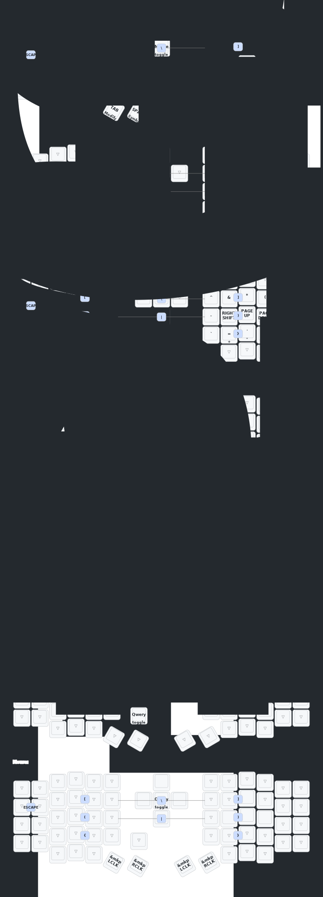

# ZMK Eyelash Sofle - English Documentation & Personal Fork

- [中文 Chinese](README.md) | [English](README_EN.md)

## 🎯 What is This?

This is **Allison Coleman's** personal fork and English translation of the ZMK firmware configuration for the **"Eyelash Sofle"** split keyboard sold on AliExpress. This board is a popular low-profile 58-key split keyboard that runs ZMK firmware with nice!nano v2 controllers.

## 🚀 Quick Start - Get Your Firmware

### For Users: Just Download & Flash
1. **Fork this repository** to your GitHub account
2. Go to **Actions** tab in your fork
3. Click **"Build ZMK Firmware"** → **"Run workflow"** → **"Run workflow"**
4. Wait 3-5 minutes for build to complete
5. Download the firmware files from **Artifacts**
6. Flash to your keyboard using drag-and-drop to the bootloader

### Pre-Built Firmware Available
- **Standard Mode**: Left + Right halves communicate directly
- **Dongle Mode**: Both halves connect to a central dongle (lower latency)
- **ZMK Studio Support**: Live keymap editing without reflashing

## 🔧 What's Included

### ✅ Hardware Configurations
- **Eyelash Sofle Left/Right**: Custom board definitions for the AliExpress variant
- **Nice!View Displays**: OLED support for both halves
- **Dongle Support**: Central receiver with OLED display
- **Settings Reset**: Factory reset firmware

### ✅ Features
- **Fast GitHub Actions**: No local build setup needed - builds in ~3 minutes
- **ZMK Studio Ready**: Visual keymap editor support
- **Multiple Layouts**: Standard split and dongle modes
- **Power Optimized**: Extended battery life settings
- **Keymap Visualizations**: Auto-generated keymap diagrams

## 📋 Supported Boards

This configuration supports the **"Eyelash Sofle"** variant commonly sold on AliExpress:
- 58-key split ortholinear layout
- Compatible with nice!nano v2 controllers
- Supports nice!view OLED displays
- Kailh Choc v1 low-profile switches
- Per-key RGB (if installed)

## 🛠️ For Developers

### Local Development
```bash
# Clone your fork
git clone https://github.com/YOUR_USERNAME/zmk-sofle.git
cd zmk-sofle

# Build locally (optional - GitHub Actions recommended)
./scripts/build-and-bond-dongle.sh
```

### Customization
- Edit `config/eyelash_sofle.keymap` for your layout
- Modify `build.yaml` for different hardware configurations
- Use ZMK Studio for live editing without code changes

## 📖 Documentation

- [`docs/quick-start.md`](docs/quick-start.md) - Getting started guide
- [`docs/dongle-mode.md`](docs/dongle-mode.md) - Dongle setup instructions
- [`docs/zmk-studio.md`](docs/zmk-studio.md) - ZMK Studio setup
- [`docs/troubleshooting.md`](docs/troubleshooting.md) - Common issues

## 🎨 Keymap Visualization



## 📝 Recent Updates

- **2024/12/21**: Added ZMK Studio support
- **2024/10/24**: Power optimization & RGB improvements
- **2025/06/14**: English documentation, dongle support, GitHub Actions

## 🤝 Contributing

This is a personal fork, but contributions are welcome!
- Fork the repository
- Make your changes
- Test with GitHub Actions
- Submit a pull request

## 📞 Support

- **Original Hardware**: Contact AliExpress seller
- **This Fork**: Open a GitHub issue
- **ZMK General**: [ZMK Discord](https://zmk.dev/community/discord/invite)

---

**Note**: This fork focuses on the AliExpress "Eyelash Sofle" variant. For other Sofle keyboards, see the original ZMK documentation.
